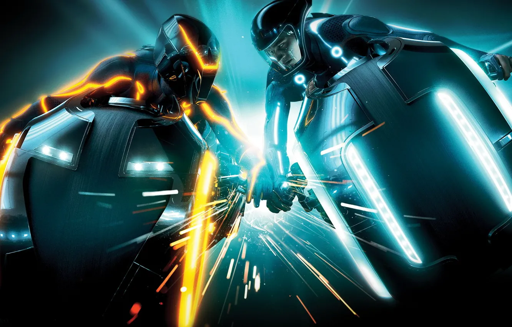

# 🏍️ TRON: Light Cycles

> Неоновая аркада в стиле вселенной TRON. Сражайся с друзьями, искусственным интеллектом или бесконечными волнами врагов в режиме выживания.

---

## 🎮 Игровой процесс

Игроки управляют световыми мотоциклами, оставляя за собой светящийся след. Цель — заставить противника врезаться в твой след или в границы арены. Последний выживший побеждает!

---

## ✨ Особенности

- 🏍️ **Три режима игры** — классика, турнир до 3 побед и бесконечное выживание
- 🤖 **Умный ИИ** — противник, который охотится за бонусами и предугадывает твои движения
- 💥 **4 типа бонусов** — ускорение, щит, клон и взрыв
- 🎨 **Неоновая графика** — атмосфера TRON с эффектами свечения, частицами и салютами
- 🏆 **Турнирная система** — сражение до 3 побед с эпичным финалом
- 🔊 **Звуковое сопровождение** — музыка, взрывы и обратный отсчет
- ☁️ **Атмосферные эффекты** — белые облака, парящие над полем
- 🎮 **Управление** — стрелки (синий) и WASD (оранжевый)

---

## 🚀 Как играть

1. Выбери противника (2 игрока / VS AI)
2. Выбери режим (Классика / Турнир до 3 / Выживание)
3. Нажми "ИГРАТЬ"
4. Побеждай!

---

## 🎯 Управление

| Игрок | Управление |
|-------|------------|
| 🔵 Синий | ↑ ↓ ← → |
| 🟠 Оранжевый | W A S D |

---

## 💥 Бонусы

| Бонус | Эффект |
|-------|--------|
| ⚡ Ускорение | Увеличение скорости на 5 секунд |
| 🛡️ Щит | Неуязвимость на 5 секунд |
| 🌀 Клон | Создает копию игрока на 3 секунды |
| 💥 Взрыв | Уничтожает всех врагов в радиусе 7 клеток |

---

## 🛠️ Технологии

- **JavaScript** — игровая логика
- **Canvas** — отрисовка и анимация
- **CSS** — неоновый стиль и адаптив
- **Web Speech API** — голосовые уведомления
- **Web Audio API** — звуковые эффекты

---

## 📁 Структура проекта
tron-light-cycles-v2/
├── index.html # Главная страница
├── css/
│ └── style.css # Стили
├── js/
│ ├── utils.js # Вспомогательные функции
│ ├── player.js # Логика игроков
│ ├── sounds.js # Звуки и музыка
│ ├── bonuses.js # Бонусы
│ ├── ai.js # Искусственный интеллект
│ ├── boss.js # Босс (режим выживания)
│ ├── survival.js # Режим выживания
│ ├── render.js # Отрисовка
│ ├── ui.js # Интерфейс
│ ├── game.js # Основная логика
│ └── main.js # Точка входа
├── assets/
│ ├── images/ # Изображения
│ └── videos/ # Фоновое видео
└── README.md

---

## 🔗 Ссылки

- **Ссылка на игру** — [Играть в TRON: Light Cycles](https://dubkow1337.github.io/tron-light-cycles-v2/)
- **GitHub** — [dubkow1337/tron-light-cycles-v2](https://github.com/dubkow1337/tron-light-cycles-v2)
- **Почта** — [dubkow14@gmail.com](mailto:dubkow14@gmail.com)

---

## 🧑‍💻 Разработчик

**dubkow1337** (REDRABBIT)

---

## 📜 Лицензия

MIT License

---

> *"Битва за территорию. Битва за жизнь."*
